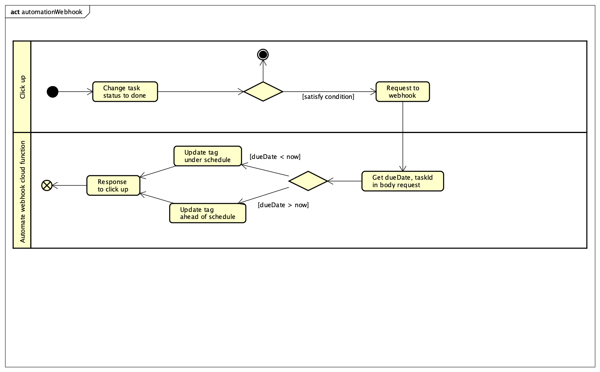
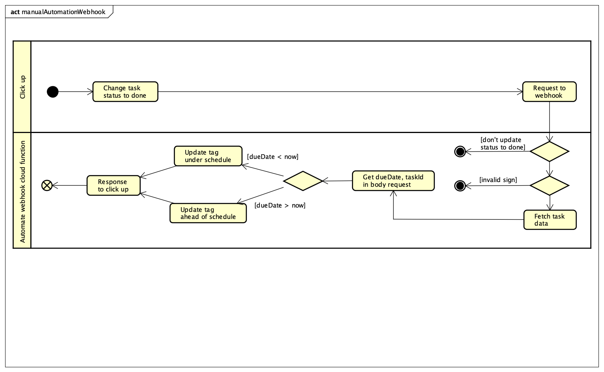

# Url deployed
- automation webhook https://us-central1-azoom-n-d-phong.cloudfunctions.net/ClickUpTaskAutomationWebhook
- manual webhook https://us-central1-azoom-n-d-phong.cloudfunctions.net/ClickUpTaskManualWebhook
# Source structure
- functions: source code
  - index.ts: function in cloud
    - ClickUpTaskAutomationWebhook: function for automation webhook
    - ClickUpTaskManualWebhook: function for manual webhook
  - endpoint.ts: endpoint's click up. Use to call api
  - dto: type of application
    - request: type of incoming request to cloud function
    - response: type of response' cloud function
  - constants.ts: constants of application
  - utils.ts: some until of application

# How it work
## 1. Automation webhook

## 2. Manual webhook 


# Prepare for Deploy
  1. Create file `.env` from `.env.sample`
  2. Replace `AUTH_TOKEN` by your token
# 1. Automation webhook
  Setup automation on click up by endpoint `ClickUpTaskAutomationWebhook` after deploy
  ```bash
  npm run deploy
  ```
# 2. Manual webhook
  ## 2.1 Create webhook if not exist
  Go to https://clickup.com/api/clickupreference/operation/CreateWebhook/ and create one webhook on your workspace:
  Mean of some field
  - team_id: your team id, azoom is `909351`
  - endpoint: is endPoint ClickUpTaskManualWebhook
  - events ["taskUpdated"]
  - space_id: optional
  - folder_id: optional
  - list_id: optional,
  - task_id: optional
  ## 2.2 Save secret 
  On response, get secret and replace `WEBHOOK_SECRET` in `.env`
  ## 2.3 Deploy
  ```bash 
  cd functions 
  npm run deploy
  ```

# 3. For debug and code
```bash
cd functions
npm run build:watch
firebase emulators:start
ngrok http 5001
```
Copy url funtion to correspond webhook clickup

## 4. Some helpful tips for develop
  - After setup ngrok, look at request body in ngrok dashboard

## 5. Donate me some coffee
  - bank: Vietcombank - nick name: delamgi
